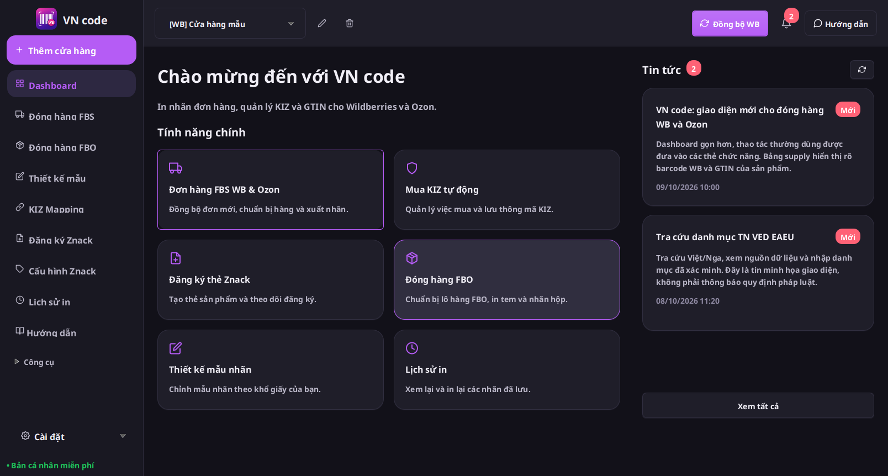
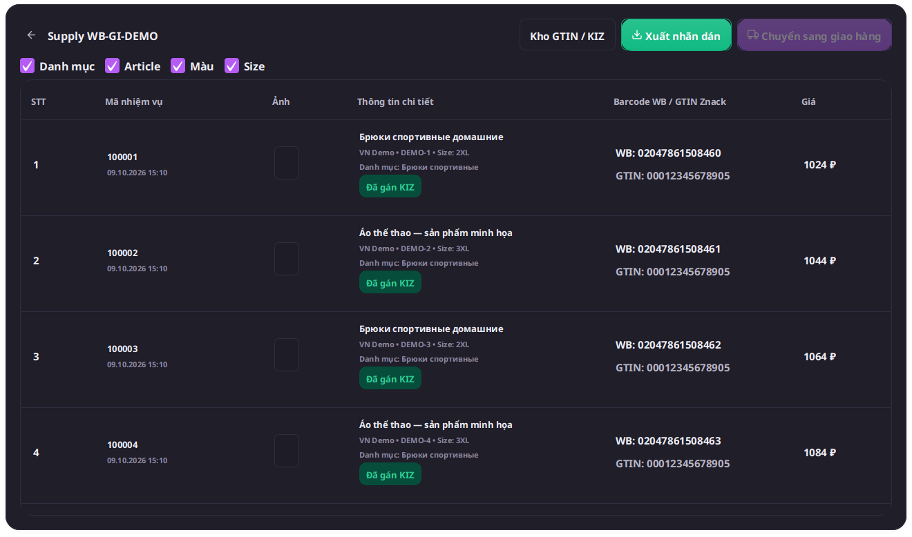
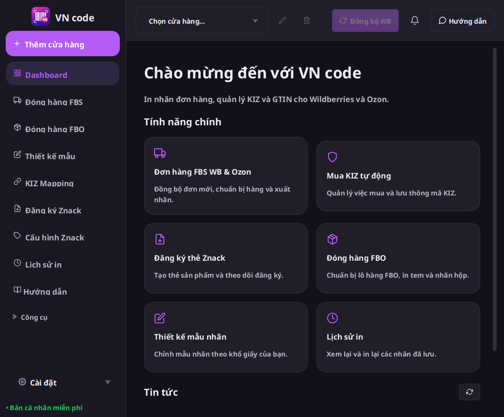

# VN code 1.2.1 — cập nhật giao diện Windows

Bản nâng cấp cho ứng dụng VN code hiện có trong Bancapnhat, giữ định danh bộ cài và thư mục dữ liệu riêng của VN code. Số phiên bản Windows tăng lên 1.2.1 để nâng cấp được cả bản 1.2.0 Preview; repository Vncode gốc được giữ nguyên. Đây là Preview, chưa tương đương toàn bộ chức năng Wbcode mới nhất.

## Đối chiếu bản mới nhất

Ngày 09/10/2026, release mới nhất của upstream là [Wbcode 1.3.0](https://github.com/rupphi/relatest-wcode/releases/tag/v1.3.0). Source công khai [test-wcode](https://github.com/rupphi/test-wcode/tree/8f7c3d1ac8598158029b8d037e2d3c128e240727) vẫn ghi phiên bản 1.1.32. Không coi file bộ cài hoặc mô tả release là mã nguồn 1.3.0.

Bộ cài Windows chính thức 1.3.0 đã được kiểm tra SHA-256 và mở trên Windows tạm: [lượt chạy quan sát](https://github.com/ntccong2468-lab/Bancapnhat/actions/runs/37967842226). Tên cửa sổ là `Wbcode v1.3.0`; menu có mục `Инструкции` (Hướng dẫn). Chưa nhập shop hoặc kích hoạt license; vùng nội dung trung tâm vẫn trống sau khi mở mục này, nên chỉ xác nhận được giao diện lần mở đầu và menu. Không xác nhận màn hình có đăng nhập hoặc nghiệp vụ GS1 bằng lượt chạy này.

[Metadata](../validation/wbcode-1.3.0-observation/observation.json), [mô tả release gốc](../validation/wbcode-1.3.0-observation/release.json), [ảnh quan sát Windows](../validation/wbcode-1.3.0-observation/official-guides-hover.png).

| Thay đổi upstream | VN code 1.2.1 |
|---|---|
| Dashboard/menu theo ảnh WCode 1.2.0 | Sáu thẻ, hai tin mới nhất, mục đang chọn màu tím, công cụ mở rộng và cấu hình dưới cùng |
| Supply WB theo ảnh đã duyệt | Sáu cột, WB barcode/GTIN riêng, ảnh 45×60, trạng thái gán KIZ và lỗi rõ ràng |
| Hướng dẫn mới trong 1.3.0 | Hướng dẫn thiết lập VN code, WB/Ozon, nhãn, GTIN/KIZ và nâng cấp; nội dung chữ Việt/Nga/Anh/Trung |
| Cửa sổ nhỏ/toolbar | Sửa đo chiều cao thẻ, cho khung chính co giãn, cuộn ngang bảng khi mở kho GTIN |
| TN VED tải chậm | Giữ truy vấn đã gửi và các trang kết quả; không cho tác vụ khởi tạo nền ghi đè thao tác mới |
| Tự đồng bộ đơn WB khi vào tab/đổi shop | Giữ luồng tự đồng bộ có sẵn và kiểm tra quyền theo shop |
| GS1 RUS/thư/hoá đơn/đơn gia nhập và thay đổi ký số 1.3.0 | Chưa triển khai: cần hợp đồng API/luồng được xác minh |
| Mua/kích hoạt license WCode | VN code vẫn là app cá nhân miễn phí theo yêu cầu chủ dự án |

## Giao diện

Ảnh dưới là snapshot JavaFX/FXML production trên môi trường Linux, dùng shop/đơn/tin minh họa, không chứa dữ liệu seller thật. Màn hình đầu tiên dùng HomeController thật với dữ liệu shop trống. Font hiển thị có thể khác máy Windows dùng Segoe UI.

[Dashboard cửa sổ nhỏ](images/vn-code-1.2.1/dashboard-compact.png), [Dashboard sáng](images/vn-code-1.2.1/dashboard-light.png), [kho GTIN ở cửa sổ nhỏ](images/vn-code-1.2.1/supply-inventory-compact.png), [Hướng dẫn](images/vn-code-1.2.1/guides.png).

## Bộ cài và kiểm tra Windows

[Tải VN code 1.2.1 Preview — Windows x64](https://github.com/ntccong2468-lab/Bancapnhat/releases/download/v1.2.1-preview.1/VN-code-1.2.1-preview.1-Windows-x64.exe), [Release và checksum](https://github.com/ntccong2468-lab/Bancapnhat/releases/tag/v1.2.1-preview.1).

Đóng VN code trước khi chạy bộ cài. Java được đóng gói kèm; bản này chưa ký Authenticode. Bộ cài giữ UUID `8CBBA0E2-6E73-4F56-9101-6BC0948D3C72`, dùng cùng thư mục VNcodeApp/VNcodeData.

[CI Windows](https://github.com/ntccong2468-lab/Bancapnhat/actions/runs/37980840932) xác minh đúng commit `b5034df00a1e898124210437c522c92448ead5b3`: **601 kiểm thử Java/JavaFX và 29 kiểm thử Node**, không lỗi hoặc bỏ qua.

| Kiểm tra thực tế trên Windows tạm | Kết quả |
|---|---|
| Cài EXE và mở cửa sổ VN code v1.2.1 | Đạt |
| Migration schema 3→4, giữ lịch sử và snapshot phục hồi | Đạt |
| Cài/gỡ cạnh WCode 1.1.75 thật | WCode giữ nguyên; VN code có registration và dữ liệu riêng |
| Nâng cấp VN code 1.1.34→1.2.1 | Một registration, dữ liệu và template giữ nguyên |
| Nâng cấp VN code 1.2.0 Preview→1.2.1 | Một registration, dữ liệu và template giữ nguyên |

[Báo cáo kiểm tra](../validation/vn-code-1.2.1/local-verification.json), [launcher/migration](../validation/vn-code-1.2.1/native-smoke.json), [cài cạnh WCode](../validation/vn-code-1.2.1/side-by-side-smoke.json), [nâng cấp 1.1.34](../validation/vn-code-1.2.1/upgrade-smoke.json), [nâng cấp 1.2.0 Preview](../validation/vn-code-1.2.1/upgrade-preview-smoke.json).

SHA-256 bộ cài: `2159133f48de2fcaaa2d39e5983157d9c713929c10479d0007f30463394d483f` (141.094.400 byte).

## Quyết định bố cục và phạm vi

Giữ menu có chữ theo ảnh 1.2.0 đã duyệt và bổ sung Hướng dẫn VN code. Giao diện này khác thanh menu chỉ có biểu tượng của Wbcode 1.3.0 khi mới mở. Bản phát hành là Preview vì chưa xác minh đầy đủ luồng đăng nhập 1.3.0 hoặc có mã nguồn tương ứng; GS1/thư/hoá đơn và thay đổi ký số còn thiếu.

## Giới hạn

Xem [trạng thái đầy đủ](VN-code-1.2.1-status.json). Chưa nghiệm thu với shop/máy in thật. GTIN hiển thị lấy từ KIZ đã gán hoặc mapping đúng sản phẩm; không dùng barcode WB làm GTIN khi thiếu dữ liệu. “Đã gán KIZ” là trạng thái gán cục bộ, không thay thế xác nhận từ marketplace.

Điểm nhỏ còn lại: tiêu đề phần thông số giao hàng thu gọn chưa đổi ngay theo ngôn ngữ; mở lại ứng dụng để đồng bộ tiêu đề này.

Preview cài thủ công; chưa phát hành signed update manifest hoặc bật tự cập nhật.
