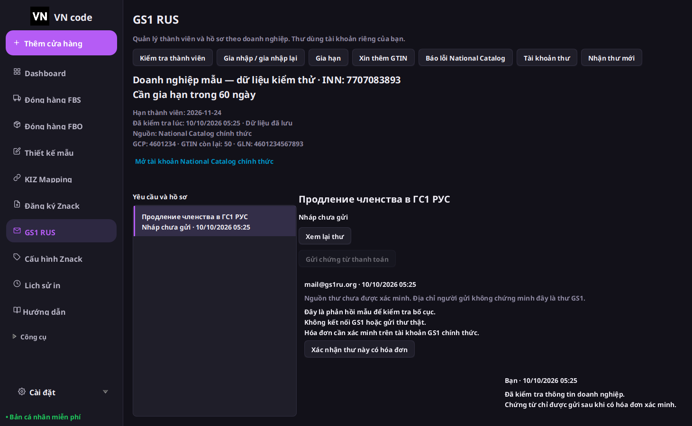

# VN code 1.3.0 Preview — GS1

Đây là bản cập nhật cho cùng VN code Windows trong repository Bancapnhat. Định danh bộ cài, thư mục dữ liệu và các chức năng VN code hiện có được giữ. Repository Vncode gốc không sửa. Logo mới là hai chữ VN trắng trên nền đen.

[Tải bộ cài VN code 1.3.0 Preview — Windows x64](https://github.com/ntccong2468-lab/Bancapnhat/releases/download/v1.3.0-preview.1/VN-code-1.3.0-preview.1-Windows-x64.exe). [Trang phát hành](https://github.com/ntccong2468-lab/Bancapnhat/releases/tag/v1.3.0-preview.1) kèm checksum và báo cáo Windows. Mã nguồn bộ cài: `7858f9c3502980c6e1d3141bbeef719c85493d04`.

Đợt này ưu tiên hoàn thiện GS1 theo yêu cầu ngày 10/10/2026. Đã đối chiếu [Wbcode 1.3.2](https://github.com/rupphi/relatest-wcode/releases/tag/v1.3.2), các lớp GS1 trong bộ cài chính thức và frontend National Catalog. Nguồn công khai WCode chỉ đến 1.1.32; không gọi backend giấy phép WCode và không đưa mã dịch ngược/binary vào VN code. Xem [tài liệu nghiên cứu](../research/2026-10-10-gs1-wbcode-132.md).

## Sử dụng GS1

1. Trong Cấu hình Znack, chọn và kiểm tra chứng thư CryptoPro của doanh nghiệp. Trang GS1 dùng INN/chứng thư đã xác minh của shop đang chọn.
2. Chọn GS1 RUS → Kiểm tra thành viên để đọc trạng thái, ngày hết hạn, GCP/GLN và hạn mức. Dữ liệu lưu được ghi rõ thời điểm; hạn mức có giá trị không tự chứng minh đang là thành viên.
3. Hồ sơ gia nhập cho sửa các bước doanh nghiệp, ngân hàng, địa chỉ FIAS, thông tin công ty và người liên hệ. Xác nhận lưu nháp trước khi lấy XML. Sau đó kiểm tra toàn bộ tài liệu và tab XML; chỉ nút Ký và gửi mới dùng chứng thư để ký đúng XML đang xem. Hủy/lỗi ký trước khi POST giữ bản nháp cho thử lại. Timeout sau khi POST không tự gửi lại. Nút Kiểm tra trạng thái hồ sơ chỉ đọc lại kết quả; đã gửi không đồng nghĩa được GS1 chấp thuận.
4. Cấu hình hộp thư SMTP/IMAP TLS của bạn. Mật khẩu được DPAPI mã hóa cho tài khoản Windows hiện tại. Lỗi kết nối/xác thực trước khi gửi giữ bản nháp để sửa cấu hình và thử lại. Nếu chưa cấu hình, có thể xuất thư .eml để xem/gửi bằng ứng dụng thư riêng; xuất file không ghi nhận thư đã gửi.
5. Soạn yêu cầu gia hạn, thêm GTIN hoặc trợ giúp lỗi National Catalog; kiểm tra địa chỉ nhận, nội dung và tệp trước khi gửi. Làm mới thư tìm theo mã yêu cầu trên toàn hộp thư, không giới hạn ở 250 thư mới nhất.
6. Thư đến luôn ghi nguồn chưa được xác minh: From và Authentication-Results do người gửi tự ghi không được coi là bằng chứng xác thực. Đối chiếu hóa đơn trên tài khoản GS1 chính thức; nhập INN, số hóa đơn, số tiền và xác nhận đã kiểm tra người nhận. Hóa đơn cũ chỉ đánh dấu bằng From không tự mở khóa gửi chứng từ.
7. Gửi chứng từ một lần cho yêu cầu đã có hóa đơn đối chiếu. Khi mất phản hồi SMTP, không tạo/gửi chứng từ khác để vượt trạng thái chưa rõ. Đối soát bằng bản .eml thực sự nằm trong hộp Đã gửi; app kiểm tra ID, người nhận, nội dung và tệp, ghi nhận xác nhận thủ công, không gọi SMTP. Bản nháp xuất ra không phải bằng chứng gửi thành công.

## Phạm vi kiểm chứng

Kiểm thử fixture bao phủ cách ly doanh nghiệp/phiên, trạng thái thiếu dữ liệu, hồ sơ thay đổi sau duyệt, XML khác doanh nghiệp, gửi trùng sau timeout, hóa đơn sai INN/yêu cầu, mã hóa MIME, thư cũ, ký cùng chứng thư và kết quả của shop cũ.

Workflow Windows đã đạt **648 kiểm thử Java/JavaFX và 33 kiểm thử Node**, mở launcher, migration, DPAPI thực và mật khẩu lưu SQLite, khóa hóa đơn chưa xác minh, cài cạnh WCode và nâng cấp giữ dữ liệu từ VN code 1.1.34 / 1.2.0 / 1.2.1 / 1.2.2. [CI Windows](https://github.com/ntccong2468-lab/Bancapnhat/actions/runs/38028666240) và [workflow phát hành](https://github.com/ntccong2468-lab/Bancapnhat/actions/runs/38030511936) đều thành công trên đúng commit bộ cài; bằng chứng được đính kèm release.

EXE có kích thước **142.088.704 byte**, SHA-256 `7b27b1ceb5d3de6c840e5cbfda8ead52898918b253b603ceaace4ef0d1e88c42`. Digest do GitHub trả về trùng với tệp EXE đã tải từ artifact và `checksums.sha256`.

Chưa nghiệm thu thao tác GS1/CryptoPro bằng chứng thư doanh nghiệp, SMTP/IMAP và tài khoản seller thật. Chưa hoàn tất toàn bộ thay đổi Products/FBO/GTIN/TN VED/trình thiết kế/số dư của bố cục đã duyệt. Danh sách đầy đủ: [trạng thái tính năng](VN-code-1.3.0-status.json). TN VED không còn menu riêng; lõi dữ liệu được giữ, liên kết trong mọi tác vụ vẫn nằm trong phần cập nhật tiếp theo.

Preview cài thủ công, chưa có Authenticode và chưa phát hành manifest tự cập nhật. Đóng VN code rồi chạy bộ cài mới để nâng cấp. Không nhập dữ liệu hoặc giấy phép WCode.
