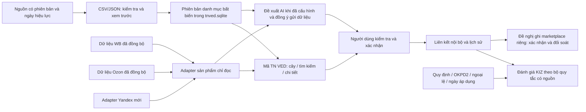

# Thiết kế đề xuất: module TN VED EAEU trong VN code Windows

Ngày: 09/10/2026, giờ Moscow. Trạng thái: chờ người dùng duyệt thiết kế; chưa triển khai module.

## Mục tiêu và căn cứ yêu cầu

Triển khai yêu cầu trong tệp “Văn bản đã dán.txt” do người dùng cung cấp, bổ sung vào bản cập nhật VN code tại Bancapnhat. Giữ nguyên ứng dụng Windows VN code, UpgradeCode, thư mục cài đặt, thư mục dữ liệu và dữ liệu WB/Ozon/KIZ hiện có. Repository Vncode gốc không bị sửa.

Trong module này, **TN VED cấp 1 là 21 phần La Mã I–XXI** theo bảng người dùng gửi. Đây không phải `cat_level` của Национальный каталог, mã TN VED hai chữ số hoặc mã GTIN. Thông tin này giải quyết cách hiểu danh mục gốc nhưng không tự xác lập quy tắc cấp lại GTIN khi đổi phần.

Thành công nghĩa là người dùng duyệt cây, tra cứu offline, đọc tên Nga và bản dịch Việt, nhập danh mục có nguồn/phiên bản, xác nhận mã cuối cho sản phẩm thật, xem lịch sử và đánh giá маркировка có căn cứ. AI chỉ đề xuất mã tồn tại, đang hiệu lực; không tự xác nhận hoặc cấp mã KIZ/GTIN.

## Khảo sát nguồn và mã hiện có

- [Quyết định 80](https://www.consultant.ru/document/cons_doc_LAW_397176/): đã đọc trang ngày 09/10/2026; tiêu đề ghi Quyết định 14/09/2021 N 80, bản sửa đổi 25/08/2026. Ngày sửa đổi không thay thế ngày hiệu lực từng quy định. Consultant là nguồn tham khảo; lưu liên kết văn bản EEC gốc khi xác minh từng phiên bản.
- [Alta](https://www.alta.ru/tnved/): trang truy cập được, cây danh mục tải bằng JavaScript. Không coi HTML trang chủ là bộ mã đầy đủ, không suy ra mã từ kết quả tìm kiếm và không giả định có API miễn phí. Chỉ nhập gói dữ liệu có nguồn được phép sử dụng và nội dung đã kiểm tra.
- [Честный ЗНАК](https://markirovka.ru/): cổng truy cập được; cần văn bản quy định của từng nhóm hàng, phạm vi và ngày hiệu lực. Trang chủ không đủ căn cứ kết luận nghĩa vụ маркировка.
- Dự án dùng Java 25, JavaFX, SQLite. Cơ sở dữ liệu chính hiện schema 4. Enum marketplace có WILDBERRIES và OZON; chưa có shop hoặc đồng bộ Yandex.

Nguồn mạng được đọc khi cập nhật dữ liệu, không phải điều kiện để mở module. Chỉ một lần kiểm tra trong môi trường đám mây chưa chứng minh kết nối tại mọi mạng ở Nga; nghiệm thu cần chạy Windows ở Nga, không VPN, cùng kiểm tra mất mạng.

## Các phương án và lựa chọn đề xuất

| Phương án | Đánh đổi |
| --- | --- |
| **SQLite riêng cho module trong thư mục VN code — đề xuất** | Không đổi schema chính; danh mục/import có thể sao lưu riêng. Liên kết shop/sản phẩm cần xác minh ở tầng dịch vụ, không có FK xuyên database |
| Thêm bảng vào SQLite chính | FK thuận tiện nhưng cần nâng schema chính, mở rộng migration và thử rollback cho toàn bộ dữ liệu hiện có |
| Tra cứu trực tiếp website mỗi lần | Phụ thuộc mạng và cấu trúc website, không đáp ứng offline và phiên bản dữ liệu có thể tái lập |

Chọn phương án đầu. `AppPaths.appDataDir()/tnved.sqlite` và thư mục `tnved/backups` dùng cùng khóa sở hữu dữ liệu của ứng dụng. Không tạo launcher, app identity hoặc bộ cài thứ hai. Installer cập nhật tại chỗ VN code. Snapshot/restore của ứng dụng phải được mở rộng để bao gồm database module khi tồn tại, nếu không một rollback sẽ mất liên kết TN VED.

## Kiến trúc và luồng dữ liệu

Các thành phần tách biệt: repository danh mục; importer; tra cứu/phân trang; liên kết sản phẩm; adapter từng marketplace; provider đề xuất AI; bộ đánh giá marking; JavaFX controller. Tác vụ IO, import, ảnh và AI chạy nền; mọi callback kiểm tra generation/phiên bản/shop trước khi cập nhật màn hình.

## Dữ liệu và quy tắc bất biến

Tạo đủ sáu bảng yêu cầu:

- `tnved_versions`: ID, nhãn phiên bản, nguồn, ngày hiệu lực, thời gian nhập, SHA-256 gói dữ liệu, trạng thái staging/verified/superseded. Không ghi đè phiên bản đã dùng.
- `tnved_nodes`: các trường người dùng yêu cầu; bổ sung `version_id`, ràng buộc duy nhất `(version_id, code)`, FK cha cùng phiên bản. `code` luôn TEXT. Phần dùng I–XXI; mã số giữ nguyên số 0 đầu. Chi tiết phân nhánh theo nguồn, không tự dựng cha bằng cắt tiền tố. Phân biệt SECTION/CHAPTER/HEADING/SUBHEADING/DETAIL/LEAF theo gói import; mã cuối chỉ hợp lệ khi 10 chữ số, `is_leaf`, đang hiệu lực vào ngày đánh giá và thuộc phiên bản đã xác minh.
- `tnved_product_mappings`: marketplace, shop, ID sản phẩm/biến thể chuẩn của adapter, node/phiên bản, trạng thái đề xuất/xác nhận/đã thay thế, người xác nhận và thời điểm. Unique index cho tối đa một liên kết chính được xác nhận mỗi định danh sản phẩm. Không dùng SKU hiển thị làm khóa duy nhất.
- `tnved_classification_reviews`: dữ kiện đầu vào, nguồn chứng nhận, tối đa ba ứng viên, lý do, thông tin thiếu, phiên bản model/provider, quyết định người dùng và lịch sử thay đổi. Không sửa/xóa lịch sử khi thay mã.
- `marking_rule_versions`: nguồn văn bản, phiên bản, thời hạn áp dụng, checksum và người kiểm tra.
- `marking_rules`: điều kiện TN VED, OKPD 2, nhóm sản phẩm, thuộc tính, ngoại lệ, mốc thời gian, căn cứ chính xác và kết quả theo bộ quy tắc đã xác minh.

Không coi chương 77 là chương có hiệu lực. Chỉ nạp phần gốc đã xác minh; chương và mã cấp dưới chưa có dữ liệu hiển thị **“Chưa tải dữ liệu”**. Bộ danh mục ban đầu chưa đầy đủ phải được ghi rõ, không dùng 21 phần làm bằng chứng đã có toàn bộ mã 10 chữ số.

## Nhập, cập nhật, sao lưu

Hỗ trợ JSON với manifest và nodes/rules; CSV UTF-8 có header bắt buộc và manifest JSON đi kèm. Manifest khai báo phiên bản, nguồn, ngày hiệu lực; không dùng tên file làm phiên bản. Import dữ liệu, không chạy script hoặc tải tùy tiện URL có trong file.

Quy trình: giới hạn kích thước → kiểm tra định dạng/ngày/mã → kiểm tra trùng, cha mất, chu trình, phần/chương và hiệu lực → xem trước số bản ghi/lỗi/nguồn → xác nhận → sao lưu SQLite nhất quán → transaction nhập staging → kiểm tra integrity/FK → kích hoạt phiên bản đã được người dùng xác minh. Lỗi hoặc hủy không thay phiên bản hoạt động. Không tự đánh dấu nguồn là đáng tin chỉ vì URL có định dạng hợp lệ.

Cập nhật tạo phiên bản mới. Mã cũ hoặc hết hiệu lực vẫn hiện trong lịch sử liên kết, được đánh dấu cần xem lại; không tự đổi sang mã mới. Restore chỉ thực hiện khi giữ khóa app-data và database đóng; trước restore tạo thêm snapshot hiện tại, kiểm tra checksum/schema/integrity. Không chép file SQLite đang hoạt động mà bỏ WAL.

## Giao diện Windows

Thêm mục **Mã TN VED** bên trái. Màn hình dùng ba vùng có thanh kéo điều chỉnh:

1. Cây 21 phần, tải con khi mở nhánh, cuộn riêng.
2. Tìm mã/tiếng Nga/tiếng Việt, lọc phần/chương/hiệu lực, bảng phân trang 100 dòng, sao chép mã. Chuẩn hóa tìm kiếm hoa/thường, ё/е và dấu Việt cho chỉ mục tìm kiếm; tên/mã lưu nguyên bản.
3. Tên Nga, bản dịch Việt có nhãn “bản dịch tham khảo”, mô tả/chú giải, nguồn/phiên bản/ngày hiệu lực, sản phẩm liên kết, kết quả KIZ và nút gán mã.

Trên cửa sổ hẹp, chi tiết chuyển thành tab để không chồng lấn; hỗ trợ light/dark, DPI 100/150/200%. Không quét toàn bộ cây trên FX thread. Hủy/tác vụ cũ không được ghi đè kết quả tìm kiếm hoặc shop mới.

## Sản phẩm và marketplace

WB/Ozon lấy dữ liệu đồng bộ đang có, chỉ đọc bảng hiện tại. Adapter trả marketplace/shop/ID sản phẩm/SKU/tên/ảnh/thuộc tính/mã từ nguồn, cùng khả năng đọc và ghi TN VED. Gán trong VN code chỉ tạo liên kết nội bộ sau xác nhận. Kiểm tra shop và sản phẩm vẫn tồn tại trước commit; liên kết mất sản phẩm trở thành lịch sử cần xem lại, không gán sang shop khác.

Yandex là phần triển khai mới: xác minh tài liệu hiện hành và định danh campaign/business/offer; bổ sung đọc sản phẩm theo adapter riêng với cấu hình xác thực riêng. Không đổi enum marketplace hiện có một cách cục bộ rồi giả định toàn bộ app hỗ trợ Yandex. Trước khi adapter đọc được sản phẩm thật, hiển thị **“Chưa kết nối Yandex”**, không tạo sản phẩm mẫu; tiêu chí tích hợp Yandex vẫn chưa đạt.

Ghi marketplace tách khỏi gán nội bộ. Với mỗi adapter phải có tài liệu trường/quyền đọc/ghi, diff giá trị cũ/mới, xác nhận, checkpoint trước request và readback sau. Timeout đánh dấu cần đối soát, không tự lặp mutation. Khôi phục giá trị cũ cũng là một thao tác ghi mới cần xác nhận/đối soát; không hứa rollback nguyên tử API ngoài.

## Đề xuất AI

Provider qua interface cấu hình được; chưa chọn nhà cung cấp và chưa có credential. Không có provider thì tra cứu/import/gán thủ công vẫn dùng được, nút AI báo chưa cấu hình. Tìm kiếm từ khóa không được gắn nhãn AI.

Đầu vào lấy các thuộc tính trong yêu cầu: tên, ảnh nếu có, chất liệu, thành phần sợi/tỷ lệ, kiểu dệt, đối tượng sử dụng, công dụng, cấu tạo, bộ sản phẩm và mã trên chứng nhận. Chỉ gửi dữ liệu cần thiết sau thông báo và đồng ý của người dùng; không gửi API token marketplace, KIZ, thông tin người mua hoặc toàn bộ database. Khóa AI lưu theo cơ chế bảo vệ credential Windows, không ghi log.

Provider nhận tập ứng viên từ danh mục phiên bản đã xác minh. Kết quả JSON được kiểm tra: tối đa ba mã, tồn tại trong phiên bản, mã cuối, đang hiệu lực, lý do/thông tin thiếu/chú giải/độ tin cậy. Loại bỏ mọi mã không hợp lệ; nếu không còn mã hoặc thiếu dữ kiện phân loại thì yêu cầu bổ sung. Model không có quyền xác nhận, sửa liên kết, ghi marketplace hoặc tạo mã mới.

## Marking và liên hệ GTIN

Ba trạng thái: **Bắt buộc**, **Không bắt buộc**, **Cần xác minh**. Chỉ hai trạng thái đầu khi tất cả điều kiện/ngoại lệ/ngày áp dụng cần thiết được đối chiếu với quy tắc có căn cứ. Thiếu OKPD 2, chứng nhận, thuộc tính hoặc quy tắc thì Cần xác minh; mỗi kết quả kèm nguồn và dữ kiện đánh giá.

Phân biệt nghĩa vụ маркировка, đăng ký sản phẩm, mua/phát hành Data Matrix và gán KIZ cho đơn. Module này không tự thực hiện ba bước sau. Không kết luận từ hai chữ số đầu, từ AI hoặc chỉ từ cờ `needKiz` marketplace.

Đổi TN VED, kể cả đổi phần I–XXI, tạo lịch sử và cảnh báo xem lại đăng ký/GTIN. **Không tự cấp GTIN mới chỉ vì đổi phần**: yêu cầu mới không cung cấp căn cứ hay hợp đồng API cho quy tắc này. Giữ workflow cấp lại có xác nhận hiện tại; tự động hóa phần đó cần quy tắc nghiệp vụ/API riêng được xác minh.

## Thứ tự triển khai và nghiệm thu

Theo thứ tự người dùng yêu cầu: database module/snapshot → nhập danh mục → cây/tra cứu → sản phẩm/adapter → AI → marking → kiểm thử tích hợp Windows. Mỗi bước có kiểm thử, nhưng không gọi toàn module hoàn tất trước khi đạt tất cả tiêu chí.

Kiểm thử bắt buộc: 21 phần; không chương 77 có hiệu lực; cha/con/chu trình; số 0 đầu; trùng phiên bản; ngày hết hiệu lực; tìm Việt/Nga/ё; không gán mã cha; một mã chính; lịch sử; cô lập shop/marketplace; import lỗi rollback; snapshot/restore/WAL; offline; AI giả lập trả mã sai; thiếu quy tắc KIZ → cần xác minh; callback cũ; cuộn/dark/DPI. Dữ liệu thử chỉ là fixture kiểm thử có nhãn, không nạp làm danh mục sản phẩm.

Đo hiệu năng bằng gói danh mục thật được xác minh; mục tiêu tra cứu trang đầu dưới 500 ms trên máy nghiệm thu đã ghi cấu hình và không chặn FX thread. Fixture lớn chỉ kiểm tra cơ chế, không chứng minh danh mục pháp lý đầy đủ. Windows upgrade kiểm tra cùng app identity và bảo toàn cả database chính lẫn `tnved.sqlite`, template/KIZ/lịch sử.

Không sử dụng credential shop thật để ghi trong CI. Các hợp đồng API dùng mock; kiểm tra đọc với tài khoản thật cần credential từ cấu hình môi trường, không nhập secret trong chat. Phát hành bản đầy đủ tiếp tục bị chặn nếu danh mục, Yandex, AI hoặc marking chưa đạt tiêu chí đã chọn.
