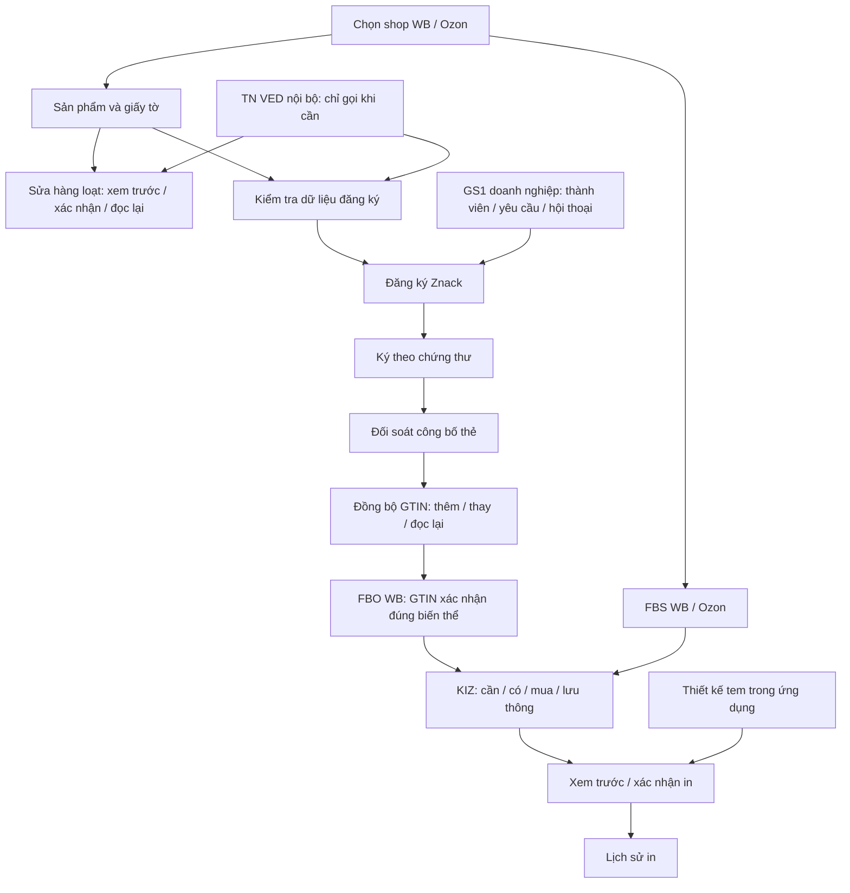

# VN code — cập nhật theo Wbcode 1.3.2

Ngày: 10/10/2026 UTC. Trạng thái: phạm vi và sơ đồ đã được người dùng duyệt; tài liệu tổng hợp này chờ rà soát trước khi lập kế hoạch triển khai.

## 1. Yêu cầu đã chốt

Áp dụng các chức năng và bố cục được duyệt trong cuộc trao đổi ngày 10/10/2026 vào **cùng ứng dụng VN code Windows** tại repository `ntccong2468-lab/Bancapnhat`. Dùng Java 25/JavaFX hiện có, giữ dữ liệu VN code, shop, mẫu tem, lịch sử, cơ chế nâng cấp và bản cá nhân miễn phí. Bản VN code hiện tại là 1.2.2 Preview.

Điều chỉnh cuối của người dùng: **bỏ mục TN VED khỏi menu; TN VED chỉ chạy nội bộ khi tác vụ cần dùng**. Logo mới là **hai chữ VN viết hoa, màu trắng trên nền đen**. Giao diện giữ nền tối tím và menu có chữ đã duyệt, có thể đổi light/dark bằng cài đặt hiện có.

Nguồn hành vi là mô tả [Wbcode 1.3.0](https://github.com/rupphi/relatest-wcode/releases/tag/v1.3.0), [1.3.1](https://github.com/rupphi/relatest-wcode/releases/tag/v1.3.1) và [1.3.2](https://github.com/rupphi/relatest-wcode/releases/tag/v1.3.2). Bản mới nhất kiểm tra ngày 10/10/2026 là 1.3.2, phát hành 09/10/2026 22:30:57 UTC. Nguồn WCode công khai đọc được vẫn là 1.1.32; không coi mô tả hoặc màn lần mở đầu 1.3.1 là bằng chứng đã quan sát mọi màn đăng nhập 1.3.2.

## 2. Ranh giới và bố cục

Tiếp tục phương án đã duyệt: các module trong cùng ứng dụng, dùng lại repository, API adapter, đăng ký National Catalog, kho/mua KIZ và CryptoPro. Không tạo runtime hoặc launcher khác. Màn Sản phẩm là điểm vào để xem/sửa dữ liệu và chuyển sang đăng ký Znack, đồng bộ GTIN hoặc đóng hàng.

Menu theo thứ tự: Dashboard → Sản phẩm → Đóng hàng FBS → Đóng hàng FBO → Thiết kế tem → KIZ Mapping → Đăng ký Znack → GS1 RUS (n) → Cấu hình Znack → Lịch sử in → Hướng dẫn. Các công cụ tài chính, đơn FBO và đồng bộ GTIN hiện có tiếp tục truy cập được trong nhóm Công cụ hoặc từ màn liên quan. TN VED không có mục điều hướng riêng, kể cả trong nhóm Công cụ.

Thanh đầu: chọn shop, sửa/xóa shop, số dư Честный знак và thời điểm cập nhật, đồng bộ theo đúng sàn, thông báo, Hỗ trợ. Giữ Dashboard sáu thẻ chức năng và cột tin tức. Nội dung, thanh công cụ và bảng phải co giãn; menu cuộn khi cửa sổ thấp. Chữ và trạng thái cung cấp đầy đủ VI/RU/EN/ZH.

## 3. Sản phẩm và chỉnh sửa hàng loạt

Màn Sản phẩm chỉ hiển thị dữ liệu thuộc shop và marketplace đang chọn. Bảng có chọn dòng, ảnh, article/tên, biến thể màu/size, thương hiệu, chất liệu, TN VED và trạng thái giấy tờ. Bộ lọc gồm tìm kiếm, danh mục và trạng thái giấy tờ; tải thêm khi cuộn bằng cursor hoặc phân trang đúng hợp đồng từng sàn. Lựa chọn dùng khóa sản phẩm/biến thể ổn định; giữ qua tìm kiếm/phân trang trong cùng shop, xóa khi đổi shop, luôn hiện tổng số đã chọn.

“Chọn tất cả” phải phân biệt chọn các dòng đã tải và chọn toàn bộ kết quả lọc. Trước tác vụ ghi, chốt tập định danh và xem trước số lượng; kết quả mới xuất hiện khi cuộn không tự thêm vào tác vụ đã xác nhận.

Trạng thái giấy tờ: xanh khi sàn xác nhận hợp lệ, cam khi đang xét duyệt, đỏ khi bị từ chối hoặc thiếu giấy tờ bắt buộc, không khiên khi chưa thêm. Khi không đọc/diễn giải được trạng thái thì hiện “Chưa xác minh”, không coi giấy tờ trong cấu hình Znack hoặc phản hồi HTTP thành công là sàn đã chấp thuận. Chi tiết có loại giấy tờ, nguồn trạng thái, thời điểm đọc và lý do nếu có.

Sửa hàng loạt chọn rõ trường cần sửa: thương hiệu, chất liệu, TN VED hoặc giấy tờ; không ghi đè các thuộc tính không chọn. WB dùng số/ngày và loại декларация hoặc сертификат; Ozon liên kết giấy tờ đã tải lên theo định danh của Ozon. Xác minh tên trường, quyền, enum, điều kiện và request/response từ tài liệu chính thức trước khi bật thao tác ghi.

Quy trình ghi: đọc mới dữ liệu → xem trước giá trị cũ/mới của từng sản phẩm → người dùng xác nhận → ghi checkpoint → gửi → đọc lại trạng thái để xác nhận. Hiện kết quả riêng từng dòng. Timeout hoặc kết quả mơ hồ chuyển sang cần kiểm tra trạng thái, không tự gửi lại. Đổi shop chỉ đổi màn hiển thị; tác vụ đang chạy vẫn giữ chủ sở hữu ban đầu và không cập nhật giao diện shop mới.

## 4. TN VED nội bộ và đăng ký Znack

Giữ `tnved.sqlite`, dữ liệu phiên bản, nguồn, hiệu lực, nhập và sao lưu hiện có. Chỉ khởi tạo dịch vụ khi tác vụ cần; chạy đọc/kiểm tra trên executor nền. Không tạo màn TN VED độc lập và không quét danh mục mỗi lần đổi tab hoặc in nhãn thông thường.

Các điểm gọi: kiểm tra trước đăng ký Znack/tạo GTIN; hỗ trợ chỉnh trường TN VED trong Sản phẩm; FBO thiếu GTIN chuyển qua đăng ký Znack dùng cùng kiểm tra. Đồng bộ một GTIN đã đăng ký không tự cấp mã khác chỉ vì kiểm tra TN VED.

Đối chiếu danh mục, giới tính, chất liệu, thành phần và kiểu dệt khi có dữ liệu và bộ phân loại được xác minh. Dữ liệu chi tiết hiện chưa đầy đủ: 21 phần gốc không được coi là đủ mã thời trang. Chỉ đề xuất mã tồn tại, đang hiệu lực, có nguồn và đủ dữ kiện; thiếu dữ liệu hiện “Chưa đủ dữ liệu để đề xuất”. Không suy nghĩa vụ KIZ hoặc tự cấp lại GTIN chỉ từ tiền tố TN VED.

Kết quả phù hợp cho tiếp tục tác vụ. Kết quả cần xử lý mở bảng ngay trong tác vụ: mã hiện tại, dữ kiện, lý do, mã gợi ý hợp lệ nếu có; cho bổ sung thông tin, giữ mã hiện tại nếu vẫn đáp ứng điều kiện đăng ký, hoặc chọn mã khác. Trường bắt buộc thiếu không được vượt qua bằng nút giữ nguyên. Cập nhật lên sàn dùng cùng xem trước/xác nhận/đọc lại rồi tiếp tục đăng ký. Tải hoặc nhập bộ danh mục có nguồn được mở từ bảng xử lý này khi cần; không tạo menu TN VED mới.

Đăng ký Znack cho bổ sung thương hiệu từng dòng hoặc nhóm đã chọn trong bảng thiếu dữ liệu. Dùng lại cơ chế chọn danh mục National Catalog hiện có; phân biệt kết quả tự chọn duy nhất với cần người dùng chọn. Giữ danh sách sản phẩm đã chọn qua tìm kiếm bằng định danh biến thể. Đổi nhãn “Bản nháp” thành “Đã tạo thẻ” ở trạng thái tương ứng, tách khỏi “Đã công bố”. Giữ checkpoint và đối soát cấp GTIN/feed hiện có để không tiêu hao thêm hạn mức khi yêu cầu trước chưa rõ kết quả.

## 5. FBO Wildberries: GTIN và KIZ

Thêm cột GTIN và nhãn thiếu/cần xác minh trong FBO WB. Mã GTIN cần đúng biến thể: shop + nmId + chrtId, đối chiếu đăng ký/công bố và đọc lại thẻ WB. Chuỗi số hợp lệ hoặc mapping KIZ theo nmId chưa đủ bằng chứng; không coi tất cả SKU WB là GTIN. Giữ số 0 đầu và dữ liệu GTIN dạng chuỗi.

Nhãn sản phẩm dùng GTIN đã xác nhận thay cho barcode WB, với kiểu barcode đáp ứng hợp đồng in/kho WB và độ dài GTIN. Nhãn KIZ là Data Matrix riêng, dùng lại mẫu và cơ chế mã hiện có. Không thay quy tắc barcode FBO Ozon chỉ từ mô tả dành cho WB.

Danh sách thiếu hoặc chưa xác minh có ảnh, tên, article, màu, size và thao tác đăng ký Znack/đồng bộ GTIN đã đăng ký. Sau xử lý, đọc lại thẻ WB rồi quay lại cùng lựa chọn và số lượng. Lựa chọn có cả hàng đủ và thiếu phải hiển thị rõ; chỉ in phần đủ khi người dùng xác nhận tập được in, không bỏ qua âm thầm.

KIZ thiếu mở bảng như FBS: cần, có sẵn có thể dùng, đang xử lý và cần mua. Số lượng đang mua chưa được tính là có thể in. Người dùng xác nhận trước mua; theo dõi mua → tải → đưa vào lưu thông → sẵn sàng. Chỉ giữ mã đủ điều kiện và đúng shop/GTIN cho lệnh in; trả reservation khi hủy trước khi sử dụng. Lỗi in ghi rõ đơn mua đang ở bước nào bằng dữ liệu đã khử thông tin nhạy cảm. Khi đủ KIZ, quay lại xem trước và người dùng xác nhận in.

## 6. GS1 RUS theo doanh nghiệp

Thêm màn GS1 RUS liên kết doanh nghiệp với các shop của người dùng. Doanh nghiệp xác định bằng INN và thông tin hồ sơ đã xác nhận; không dùng tên shop làm định danh doanh nghiệp. Thông tin thành viên, hết hạn, GCP/GLN và hạn mức có nguồn/thời điểm xác minh. Hạn mức đọc từ National Catalog không tự chứng minh tư cách thành viên hay ngày hết hạn. GCP ẩn khi doanh nghiệp hết hạn hoặc bị loại.

Yêu cầu hỗ trợ gia nhập/gia nhập lại, gia hạn, xin thêm GTIN và báo lỗi gửi đơn National Catalog. Wizard điền sẵn dữ liệu doanh nghiệp, ngân hàng, điện thoại, email và địa chỉ khi đọc được đúng hợp đồng. Người dùng xem lại dữ liệu; mặc định may mặc/OKVED 47.91/chức vụ Предприниматель chỉ áp dụng khi phù hợp với hồ sơ đã chọn. Xem trước nội dung, người gửi, người nhận GS1 và tệp đính kèm trước một xác nhận gửi. Địa chỉ nhận phải được kiểm tra từ nguồn chính thức, không hardcode địa chỉ suy đoán.

Gửi/nhận dùng adapter do VN code quản lý, độc lập với backend hay giấy phép WCode. Ưu tiên hợp đồng GS1 chính thức khi xác minh được; nếu quy trình chính thức dùng email, kết nối hộp thư của chủ ứng dụng qua SMTP/IMAP hoặc API mail có xác thực và TLS. Cấu hình credential trong ứng dụng/cơ chế bảo vệ Windows, không nhập secret vào cuộc trò chuyện hay lưu trong repository. Khi chưa kết nối, hiện đúng trạng thái chưa kết nối; không tạo thư giả hoặc báo đã gửi.

Hộp thư trái, hội thoại phải; thư của người dùng bên phải, GS1 bên trái; thư dài thu gọn 10 dòng, mở hội thoại cuộn đến thư mới nhất. Có số chưa đọc trên menu, dấu đã đọc, tải hóa đơn, tệp đính kèm và lịch sử theo thời gian. Hướng dẫn tiếng Việt dựa trên trạng thái được xác nhận; nội dung thư chưa phân loại rõ vẫn giữ nguyên để người dùng đọc, không tự kết luận đã chấp thuận.

Các trạng thái tách riêng: nháp → chờ xác nhận → đang gửi → đã gửi/chưa rõ kết quả → đã nhận phản hồi → có hóa đơn → đã gửi chứng từ → GS1 xác nhận kết quả. “Đã gửi” chỉ sau xác nhận của kênh gửi; không đồng nghĩa GS1 xử lý xong. Đối soát message/request ID khi gửi timeout trước khi lặp. Khung thanh toán/chứng từ chỉ mở sau hóa đơn liên quan được xác nhận, theo đúng doanh nghiệp/yêu cầu. Phí GS1 do hóa đơn GS1 thể hiện; không có license WCode hoặc tự thu tiền trong VN code.

Lỗi National Catalog khi chia sẻ cho GS1 được hiển thị cho người dùng xem trước và khử token, raw KIZ, response nhạy cảm/PII không cần thiết. Ký đơn GS1 trên Windows dùng CryptoPro khi hợp đồng nhận hồ sơ xác định rõ nội dung/định dạng chữ ký; hỗ trợ ký chứng thực chưa được coi là hoàn tất khi chỉ sinh CMS.

## 7. Ký số và danh mục thay đổi

Thay khóa ký toàn cục hiện tại bằng điều phối theo dấu vân tay chứng thư đã resolve và chuẩn hóa. Các shop dùng cùng chứng thư phải ký lần lượt; chứng thư khác có thể chạy đồng thời khi provider Windows đáp ứng. Kiểm tra tình huống hộp thoại PIN/token native; giới hạn tương tác provider nếu cần nhưng không dùng khóa shop làm thay thế danh tính chứng thư.

Áp dụng cùng điều phối cho các điểm ký của pipeline KIZ, auth National Catalog, thẻ và hồ sơ GS1 đã được hỗ trợ. Giữ quyền ký theo shop/pipeline và việc tác vụ khôi phục chờ người dùng chọn shop; khởi động lại không tự mở token/PIN của shop chưa được cho phép. Lỗi hiển thị shop và bước, không lộ nội dung chữ ký hoặc hồ sơ.

Tác vụ có định danh, chủ sở hữu, loại hồ sơ, GTIN/feed/good ID khi có, chứng thư và trạng thái; phục hồi ưu tiên đọc kết quả từ dịch vụ. Khi danh mục thay đổi giữa lần đọc, bỏ snapshot không nhất quán và đọc lại từ đầu, tối đa ba lần cho một lượt tác vụ. Đây là giới hạn thiết kế của VN code, không phải con số do Wbcode công bố. Không phát lại cấp GTIN/gửi feed/ký-gửi hồ sơ đã có kết quả mơ hồ. Trước ký, đối chiếu đúng thẻ và payload mới; sau gửi kiểm tra kết quả theo định danh.

Màn theo dõi ký nằm trong Cấu hình Znack, có shop, chứng thư/thời hạn, tác vụ, bước và lỗi. Các thao tác tiếp tục/kiểm tra trạng thái không vượt quyền ký hoặc làm mất chủ sở hữu khi đổi shop. Ký nghiệp vụ CryptoPro tách khỏi Authenticode của EXE; chưa có chứng thư Authenticode thì bộ cài vẫn được mô tả là chưa ký.

## 8. Thiết kế tem, tải dữ liệu và trợ giúp

Trình thiết kế tem nhúng trong vùng nội dung chính, không mở Stage modal riêng. Trên là loại/mẫu tem và các lệnh tạo, sao chép, đổi tên, xóa, mặc định, lưu; trái danh sách thành phần, giữa preview, phải thuộc tính. Giữ mẫu cũ và đơn vị mm. Có kiểm tra dữ liệu và xử lý lưu/bỏ thay đổi khi đổi mẫu hoặc rời màn hình. Cửa sổ hẹp thu gọn/tab hóa vùng thuộc tính thay vì chặn mở ứng dụng bằng min width của cửa sổ thiết kế cũ.

Danh sách tải lần đầu dùng khung chờ tải, trạng thái rỗng/lỗi phân biệt. Có cache FBS thì hiện ngay với thời điểm dữ liệu trong khi làm mới nền. Giữ cơ chế VN code 1.2.2: nhận một yêu cầu in khi đang sync, chỉ tiếp tục sau sync thành công, hủy khi lỗi/đổi shop hoặc lô, không in cache lỗi. Kết quả đọc cũ không ghi đè màn/tìm kiếm mới.

Số dư Честный знак dưới 500 ₽ hiện cảnh báo trên header. Cache gắn doanh nghiệp/shop và thời điểm; không đọc được số dư không coi là 0 hay dữ liệu mới. Tải số dư chạy nền, mở chi tiết có nguồn và thời điểm.

Nút Hỗ trợ giữ quyền truy cập Hướng dẫn. Khi bổ sung kênh trao đổi, ảnh đặt phía trên tin nhắn có viền và tệp đính kèm theo yêu cầu đang xem; kênh gửi/nhận thuộc VN code và cần cấu hình thật. Không dùng dịch vụ hỗ trợ WCode như dịch vụ VN code.

## 9. Logo VN

Logo vuông, nền đen `#000000`, chữ `VN` viết hoa trắng `#FFFFFF`, nét đậm sans-serif, căn giữa và có khoảng trống quanh chữ. Không thêm barcode, chữ WB, gradient, biểu tượng hoặc chữ khác. Không thay app identity hay tên hiển thị VN code.

Cập nhật đồng bộ PNG trong giao diện/biểu tượng cửa sổ, ICO ở resource và `app.ico` phục vụ bộ cài Windows; các kích thước ICO 16/32/48/64/128/256 phù hợp taskbar/desktop/Start Menu. Asset nền đen không trong suốt. Đồng bộ các asset biểu tượng còn được đóng gói để không còn logo cũ trong sản phẩm; bản lưu lịch sử/ảnh đối chiếu vẫn là bằng chứng phiên bản cũ.

## 10. Lưu trữ, an toàn nâng cấp và hợp đồng ngoài

Giữ UpgradeCode `8CBBA0E2-6E73-4F56-9101-6BC0948D3C72` và thư mục dữ liệu VN code hiện có. Migration additive, có snapshot nhất quán, integrity/foreign-key check và kiểm thử từ schema cũ. Snapshot phục hồi phải bao gồm `tnved.sqlite` khi có. Test dùng appdata tạm, không database hoặc credential seller thật.

Repository/API operation xác minh shop và marketplace bất biến. Credential, raw KIZ, raw response, CMS và thông tin nhạy cảm không vào log hoặc tài liệu kiểm thử. Tác vụ seller mutation/GS1 gửi thật trong nghiệm thu cần tài khoản và fixture được người dùng xác nhận riêng; việc viết code không tự cho phép gửi thư hoặc sửa shop thật từ môi trường này.

Các hợp đồng chưa có bằng chứng đầy đủ khi viết tài liệu: WB phân biệt GTIN đã đăng ký trong danh sách SKU; đọc/ghi và trạng thái giấy tờ WB/Ozon; dữ liệu phân loại TN VED thời trang đầy đủ; GS1 hồ sơ/thành viên/gửi/nhận/ký; số dư Честный знак. Mỗi hợp đồng phải có nguồn chính thức, định danh/quyền, mẫu request/response đã khử dữ liệu nhạy cảm, lỗi/timeout, cách đọc xác nhận và kiểm thử adapter. Hoàn thiện những bằng chứng này là công việc triển khai cần làm; không gọi toàn bộ bản cập nhật hoàn tất khi còn module chỉ có giao diện hoặc chưa có kết nối thật.

## 11. Nghiệm thu

1. Menu không có TN VED; tác vụ liên quan vẫn kiểm tra được và xử lý thiếu dữ liệu ngay tại chỗ, không tự sửa marketplace.
2. Sản phẩm WB/Ozon hiển thị, lọc, tải thêm và giữ lựa chọn đúng shop/biến thể. Trạng thái giấy tờ lấy từ nguồn đúng, trạng thái không rõ không xanh.
3. Sửa hàng loạt có diff/xác nhận, giữ thuộc tính không chọn, kết quả riêng dòng; timeout đối soát; tác vụ shop cũ không ghi sang shop mới.
4. Đăng ký giữ lựa chọn qua tìm kiếm, bổ sung thương hiệu, phân biệt đã tạo thẻ/công bố; TN VED đủ căn cứ mới gợi ý; phục hồi không cấp GTIN/feed trùng.
5. FBO WB chỉ in GTIN đúng biến thể đã xác nhận trên WB; danh sách thiếu đủ thông tin; lựa chọn hỗn hợp xin xác nhận tập in. Ozon giữ hợp đồng nhãn của Ozon.
6. Mua KIZ thiếu có bảng số lượng/tiến trình và xác nhận; mã đang xử lý chưa in được; reservation/publish/lỗi/hủy giữ nhất quán và có bước đơn mua trong báo cáo.
7. GS1 có dữ liệu doanh nghiệp có nguồn, các loại yêu cầu, gửi/nhận thật với tài khoản thử được cho phép, thư chưa đọc/hội thoại/hóa đơn/chứng từ; gửi không bị nhầm thành chấp thuận.
8. Cùng chứng thư không ký đồng thời; chứng thư khác không bị khóa chung khi provider hỗ trợ; quyền shop/pipeline và phục hồi giữ nguyên. Quét lại danh mục có giới hạn và không phát lại mutation mơ hồ.
9. Thiết kế tem mở trong ứng dụng; mẫu cũ, chỉnh sửa/lưu và trường hợp rời màn còn thay đổi hoạt động. Header số dư đúng ngữ cảnh; cache và khung chờ tải không làm in nhầm dữ liệu.
10. Logo VN trắng nền đen nhất quán trong sidebar, cửa sổ, taskbar và bộ cài; DPI 100/150/200% không cắt chữ. Copy UI VI/RU/EN/ZH đầy đủ.
11. Kiểm thử Java/domain có ca lỗi, race, timeout và cô lập shop; JavaFX FXML smoke và kiểm tra giao diện; Maven verify và Node packaging contract test thực sự chạy đủ.
12. Windows EXE mở được, cùng app identity, nâng cấp từ VN code 1.1.34/1.2.0/1.2.1/1.2.2 giữ database, TN VED và mẫu tem; cài/gỡ bên cạnh WCode không ảnh hưởng dữ liệu WCode. Chỉ phát hành sau khi báo cáo thể hiện chính xác các tiêu chí đã đạt và phần chưa đạt.

## 12. Sơ đồ tổng hợp đã điều chỉnh

